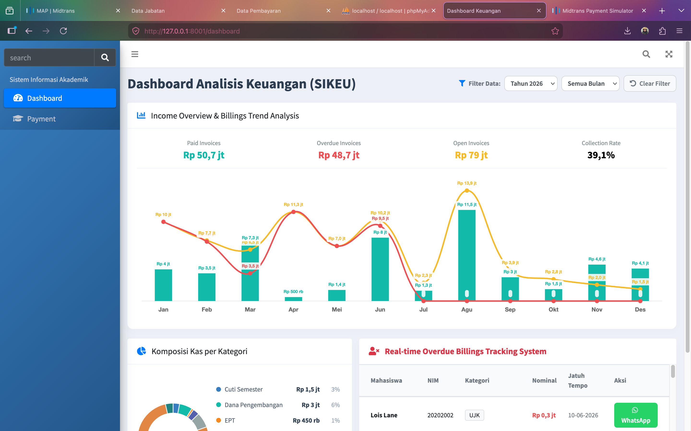
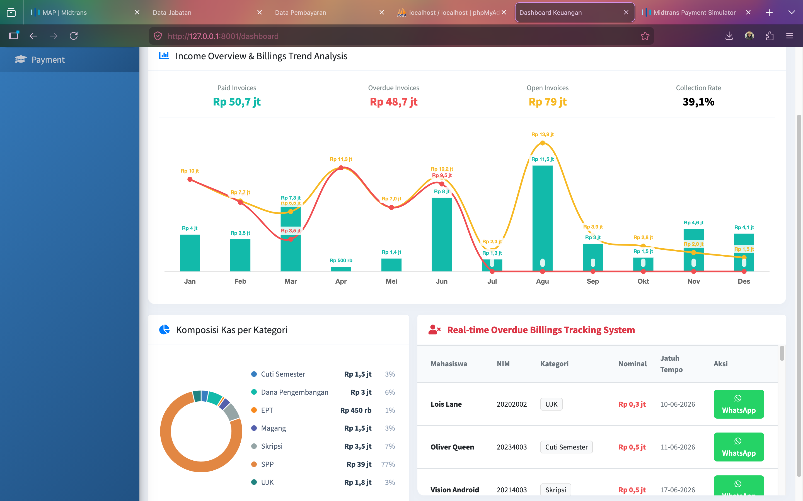

# Integrated Campus Information System

A university management system developed for the Cooperative and Integrated Systems course. The project integrates three independent Laravel applications through cross-database communication.

## Overview

This project consists of three integrated information systems:

- **SIAKAD** – Academic Information System
- **SIMPEG** – Human Resource Information System
- **SIKEU** – Financial Information System

The systems are developed as separate Laravel applications and connected through multiple database connections, allowing data sharing without physically merging databases.

## Modules

### 1. SIAKAD (Academic Information System)

- Student management
- Course management
- Lecturer information
- Payment monitoring dashboard


### 2. SIMPEG (Human Resource Information System)

- Employee management
- Academic position management
- Lecturer information provider for SIAKAD


### 3. SIKEU (Financial Information System)

- Billing management
- Financial analytics dashboard
- Midtrans payment integration




## Key Features

- Cross-database integration between systems
- Full CRUD operations
- Automatic academic code generation
- Interactive dashboards using Chart.js
- Midtrans Snap payment gateway integration
- AdminLTE-based interface

## Technology Stack

- Laravel 13
- PHP 8
- MySQL
- AdminLTE
- Chart.js
- jQuery
- DataTables
- Midtrans Snap API

## Project Structure

```text
.
├── siakad/
├── simpeg/
├── sikeu/
└── images/
```

## Database Architecture

```text
integrasi_siakad
        │
        ├── mahasiswa
        └── mata_kuliah

integrasi_simpeg
        │
        ├── pegawai
        └── jabatan

sikeu
        │
        └── tagihan
```

## Integration Flow

- SIAKAD reads lecturer data from SIMPEG.
- SIAKAD reads billing information from SIKEU.
- SIKEU reads student data from SIAKAD.
- SIMPEG provides academic position data for lecturers displayed in SIAKAD.

## Course Information

**Course:** Cooperative and Integrated Systems

**Author:** Nabila Hulwana Z

## License

This repository is intended for academic and educational purposes.
